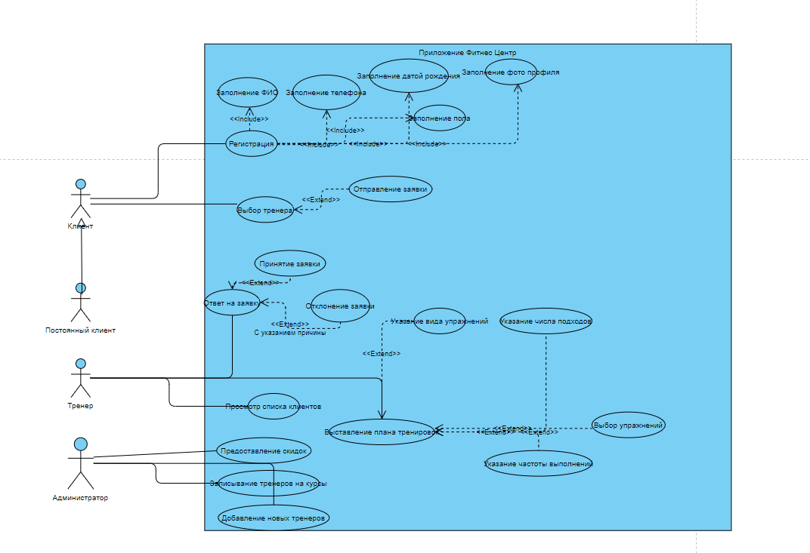
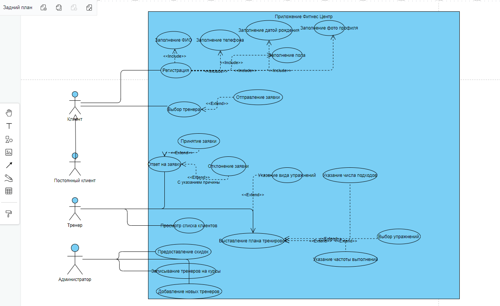
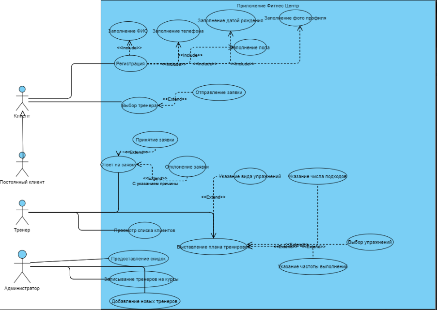

<table style="width: 100%;">
  <tr>
    <td style="text-align: center; border: none;"> 
    Минестерство образования и науки РФ  
    ГБПОУ РМЭ "Йошкар-Олинский Технологический колледж </td>
  </tr>
  <tr>
    <td style="text-align: center; border: none; height: 15em;"><h2>Отчет по лабораторной работe<h2> 
    По теме: "Построение UML-Диаграммы Фитнес-Центр"
    </td>
  </tr>
  <tr>
    <td style="text-align: right; border: none; height: 20em;">
      Разработали: Игимбаев Тимур и Шарапова Екатерина 
      Группа: И-31 
      Проверил: Колесников Е.И.       
    </td>
  </tr>
  <tr>
    <td style="text-align: center; border: none; height: 5em;">
    г.Йошкар-Ола, 2021</td>
  </tr>
</table>

GOOGLE DISK: https://drive.google.com/file/d/1etzNRvmMjy2v4evSN8o5qReBx1eDXbB_/view?usp=sharing